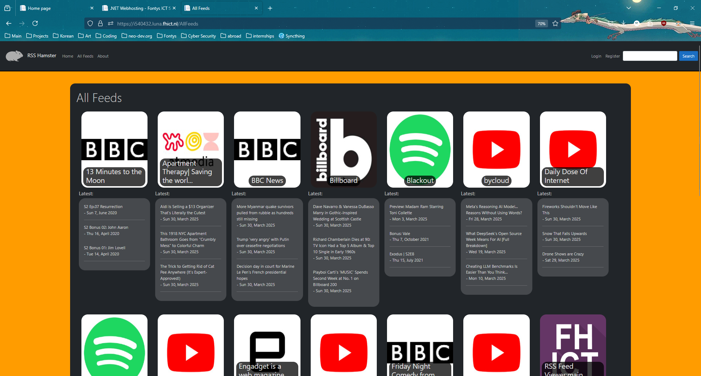
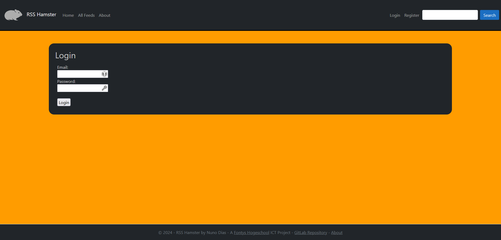
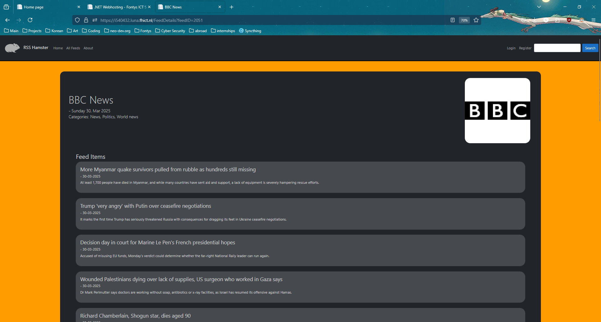
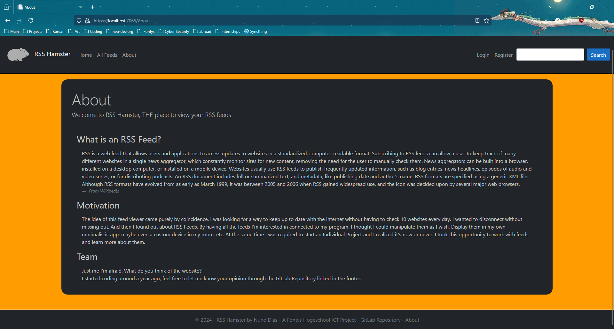
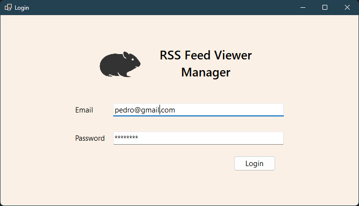

<h1 align="center">
   
  
   
  RSS Hamster
   
</h1>

<h4 align="center">An RSS feed aggregator made in Visual Studio using WinForms for a desktop app and ASP.Net Razor pages for the web page.</h4>

<!-- Horizontal short Menu (w\ Links) -->

  <a href="#key-features">Key Features</a> •
  <a href="#gallery">Gallery</a> •
  <a href="#retrospective">Retrospective</a> •
  <a href="#credits">Credits</a>

## Key Features

- User friendly interface
- Adding feeds from links and choosing from different parsers
- Accounts with followed feeds and recommendations (only if specifically asked for)
- Media embeds for feeds that provide them
- If you wish to run the binaries they are in the [releases](https://github.com/N4fta/RSS-Hamster/releases) but neither application will function correctly since the Database they rely upon is not being hosted anymore

## Gallery

> **Note:**
> Some tabs are missing since the user was not logged in, notably _My Feed_ and _Recommendations_

> **Note:**
> I was not able to get more screenshots of the WinForms app since the database is down and I don't have access to the database anymore

## Retrospective

This project was done in parallel with [ZooBaazar](https://github.com/N4fta/ZooBaazar) and as can be seen, it is a lot easier to work alone as a beginner. Thankfully I learned ways to plan and collaborate this semester and my next group project went much better.

This project helped me learn the importance of design. Before the colour pallete become what it is, I used a grey on black pallete and the feedback was much worse than after the design change, even though the websites function were basically the same. To clients, what they see is more important than what is beneath.

I also learned more complex systems, relational databases, comlex queries which I used to create an "algorithm", essentially a more complex query. And packages. Libraries made by other developers are as powerful as they are dangerous. This time I only used 2 big ones and that helped a lot. However when I later used Node.js for the first time I ended up with 104 packages and half of them had vulnerabilities. Truly a powerful but deadly tool.

The last big topic I leaned about was testing. This is a life-saver. Although they are painfully dull and time consuming to make they are essential to keep a project secure and make sure nothing breaks with new changes. A very valuable tool.

## Credits

This software uses:

- [WinForms](https://learn.microsoft.com/en-us/dotnet/desktop/winforms/?view=netdesktop-9.0)
- [Razor Pages](https://learn.microsoft.com/en-us/aspnet/core/razor-pages/?view=aspnetcore-9.0)
- [MSSQL](https://www.microsoft.com/en-us/sql-server/sql-server-downloads)
- [FeedReader Library Nuget Package](https://github.com/arminreiter/FeedReader/)
- [BCrypt.Net-Next Nuget Package](https://www.nuget.org/packages/BCrypt.Net-Next/4.0.3?_src=template)

Created by myseld at [Fontys](https://www.fontys.nl/).

Developed Spring 2024

### My Links

> [neo-dev.org](https://neo-dev.org) &nbsp;&middot;&nbsp;
> GitHub [@N4fta](https://github.com/N4fta)
